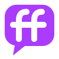
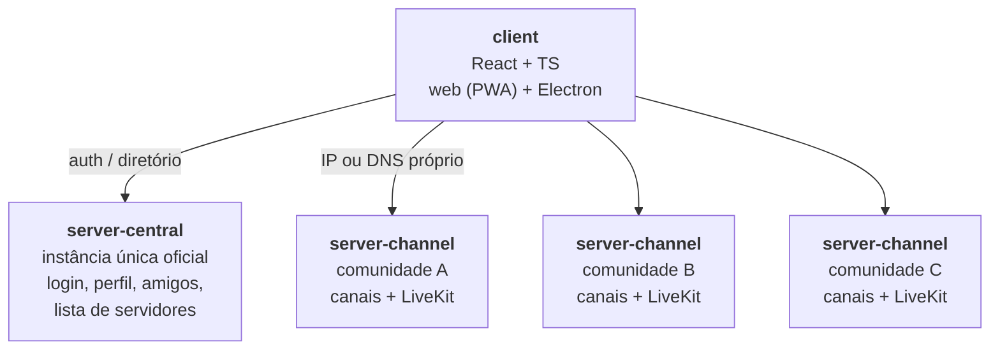

# FFCom

**Sua comunidade, no seu servidor.**

*Friends & Family Communication*

[Site](https://ffcom.a3sitsolutions.com.br/) · [Histórico de versões](CHANGELOG.md) · [Arquitetura](docs/architecture.md) · [Como contribuir](CONTRIBUTING.md)

---

Alternativa self-hosted ao Discord: organização em servidores, categorias e canais (texto, voz, forum), mas cada "servidor" é hospedado por quem cria a comunidade, via IP ou DNS próprio, em vez de depender de uma empresa central controlando tudo.

## O que já funciona

- **Chat de texto** em canais organizados por categoria, com anexos, edição e exclusão de mensagens.
- **Voz, vídeo e compartilhamento de tela** pelo LiveKit, com relay TURN/TLS pela porta 443 para quem está atrás de rede restritiva.
- **Canais de fórum** ao lado dos de texto e voz.
- **Amigos e mensagens diretas** cifradas de ponta a ponta, com a chave recuperável por frase de recuperação.
- **Roles e permissões** por servidor e por canal, com convites para trazer gente nova.
- **Login único** na instância central (OIDC), valendo para todos os servidores que você frequenta.
- **Web (PWA) e app para Windows** a partir da mesma base de código; o app desktop se atualiza sozinho.

## Arquitetura

Um mesmo client fala com a instância central (identidade e diretório) e com quantos `server-channel` a pessoa participar, cada um rodando na máquina de quem criou a comunidade.

- **[client](client/)** — interface gráfica, web + desktop (Electron) a partir da mesma base de código.
- **[server-central](server-central/)** — instância única oficial em `ffcom.a3sitsolutions.com`: login, perfil, lista de amigos, diretório de servidores.
- **[server-channel](server-channel/)** — o "servidor" propriamente dito, hospedado por quem cria a comunidade (categorias, canais de texto/voz/forum).
- **[site](site/)** — home page pública em `ffcom.a3sitsolutions.com.br` (HTML/CSS estáticos) e identidade visual do projeto.

## Hospedar o seu servidor

O `server-channel` sobe com Docker Compose (Postgres, LiveKit e o serviço) usando a imagem publicada `ghcr.io/apolope/ffcom-channel:1`, para `linux/amd64` e `linux/arm64`; não é preciso compilar nada, e o serviço se atualiza sozinho a partir de releases assinados. O passo a passo, as variáveis e as portas estão em [`server-channel/README.md`](server-channel/README.md).

## Documentação

- [`docs/architecture.md`](docs/architecture.md) — decisões técnicas, alternativas consideradas e por quê (formato ADR).
- [`docs/protocol.md`](docs/protocol.md) — protocolo/API entre `client`, `server-central` e `server-channel`.
- [`docs/backup-restore.md`](docs/backup-restore.md) — backup e restore do Postgres e dos volumes de arquivo de `server-central`/`server-channel`.
- [`CHANGELOG.md`](CHANGELOG.md) — o que cada versão publicada trouxe, por componente.
- [`TODO.md`](TODO.md) — backlog unificado por tema.
- [`CONTRIBUTING.md`](CONTRIBUTING.md) — ambiente de desenvolvimento, convenções de código, testes/lint e processo de contribuição.

## Status

Implantação de teste no ar desde 2026-09-21 (`app.ffcom.a3sitsolutions.com.br`, infra do `a3s-network`), com login OIDC, chat de texto, voz/vídeo, forum, roles/permissões, convites e DMs funcionando ponta a ponta. Restam principalmente testes com múltiplos usuários reais e a decisão do domínio de produção definitivo (`.com` vs `.com.br`) — ver `TODO.md` para o detalhe.

## Licença

O FFCom é distribuído sob a [GNU Affero General Public License v3.0](LICENSE) ou qualquer versão posterior (`AGPL-3.0-or-later`). Você pode usar, estudar, modificar e hospedar o código à vontade; se rodar uma versão **modificada** para outras pessoas usarem pela rede (um `server-channel` alterado, por exemplo), precisa oferecer a elas o código-fonte dessa versão. Hospedar o código como está publicado aqui não exige nada além de manter o aviso de licença.
